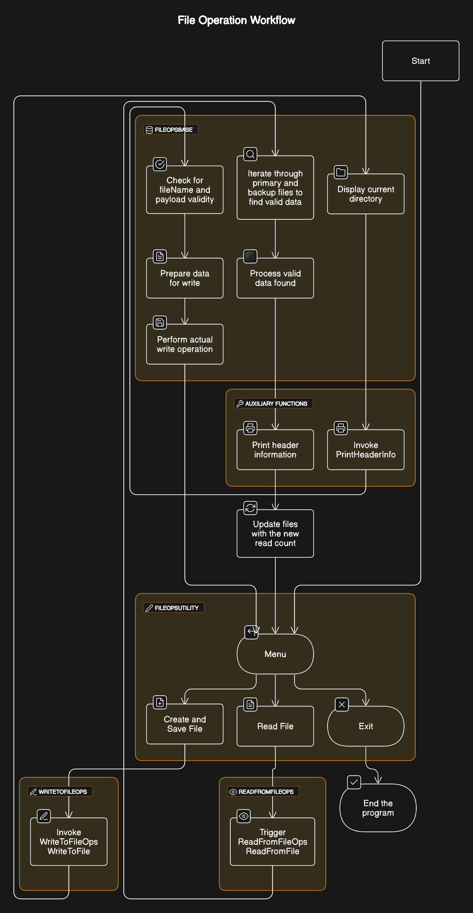

<p align="center">
  <a href="LINK-TO-YOUR-PROJECT" rel="noopener">
    
  </a>
</p>

<h3 align="center">C++ File Operations System</h3>

<div align="center">

[]()
[](https://github.com/cristoph143/CPP_FILE_MANAGEMENT_SYSTEM/issues)
[](https://github.com/cristoph143/CPP_FILE_MANAGEMENT_SYSTEM/pulls)
[](/LICENSE)

</div>

---

<p align="center"> A robust C++ application designed to handle file operations seamlessly with a user-friendly menu-driven interface.
</p>

## 📝 Table of Contents
- [About](#about)
- [Getting Started](#getting_started)
- [Prerequisites](#prerequisites)
- [Compilation](#compilation)
- [Running the Application](#running)
- [Usage](#usage)
- [Flow Details](#flow)
- [Key Operation Details](#key_operations)
- [System Process Details](#system_process)
- [Authors](#authors)
- [Acknowledgments](#acknowledgments)

## 🧐 About <a name = "about"></a>
This project is a menu-driven C++ application that allows for creating, reading, and managing files. It employs object-oriented principles and efficient data handling techniques to ensure a smooth and intuitive user experience.

## 🏁 Getting Started <a name = "getting_started"></a>
These instructions will get you a copy of the project up and running on your local machine for development and testing purposes.

## 🚀 Prerequisites <a name = "prerequisites"></a>
What things you need to install the software and how to install them.
- A modern C++ compiler capable of C++17 standards (e.g., GCC, Clang, MSVC)
- Basic knowledge of C++ and file handling

## 🔧 Compilation <a name = "compilation"></a>
To compile the application, navigate to the project directory and run the following command:

```
g++ -o file_ops main.cpp file_ops.cpp -I include
```
Replace main.cpp and file_ops.cpp with the actual filenames of your project. The -I include flag is used to include the directory where the header files are located.

##🎈 Usage <a name="usage"></a>
To run the application, you can use the following command:

```
./file_ops
```
Follow the on-screen instructions to perform file operations.

## 🎈 System Process Details <a name="system_process"></a>

The system follows a structured process that encompasses the entire lifecycle of file operations within the application. The processes include initialization, user interaction, data handling, and cleanup.

### A. Create and Save File Process

This operation involves prompting the user for input, creating or modifying a file with the given input, and saving the changes persistently.

Involves the `WriteToFileOps` class methods for orchestrating the file writing process:

1. **Data Preparation**: Utilizes `PrepareDataForWrite` to organize data into a proper format and calculate total file size.
2. **Encryption**: Optionally encrypts data via `EncryptDecrypt` for added security.
3. **File Writing**: Leverages `WriteDataFile` to physically write data to the filesystem.

### B. Read File Process

This operation consists of opening a specified file, reading its contents, and presenting them to the user in a readable format.

Leverages the `ReadFromFileOps` class methods for the reading and processing of files:

1. **File Reading**: Executes `ReadFromFile`, which calls `readFileData` to read the file contents into memory.
2. **Data Validation**: Employs `ProcessValidData` to validate and decrypt the read data.
3. **Content Display**: Uses `PrintHeaderInfo` to output file contents to the user.

### Additional Key Functions

These are utility functions in `FileOpsBase` that support file operations:

- **getFullPath**: Constructs a full path for a file, ensuring directory existence.
- **FileExists**: Checks if a file exists at a given path.
- **CalculateCRC**: Computes CRC for raw data to ensure integrity.
- **EncryptDecrypt**: Encrypts or decrypts data in place.
- **GetBackupFilename**: Generates a filename for file backups.
- **createDirectory**: Creates a new directory if it doesn't already exist.
- **PrintHeaderInfo**: Prints the header information in a human-readable format.

<p align="center">
  <a href="" rel="noopener">
    
  </a>
</p>

## ✍️ Authors <a name = "authors"></a>

- [@cristoph143](https://github.com/cristoph143) - author